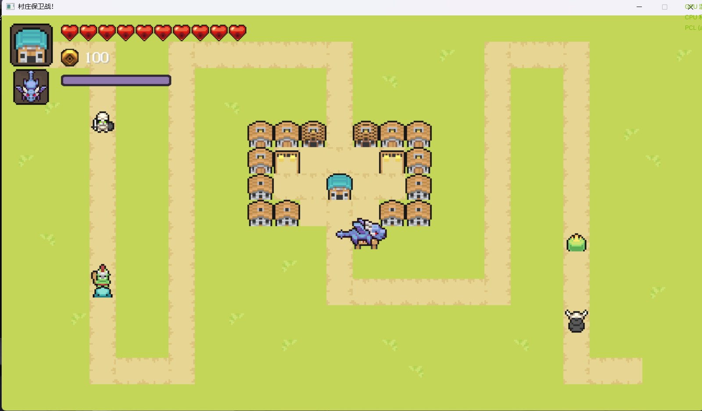

# TowerDefence【双人塔防游戏】

## TODO：

| 功能                      | 详细介绍             | 预期时间    |
| ------------------------- | -------------------- | ----------- |
| 创建房间[网络通信]        | 真正意义的双人游戏   | 2025年4月底 |
| 游戏编辑[自定义地图/关卡] | 提高自由度和可游玩性 | 2025年4月底 |

## 预览图

## 启动项目

### 克隆项目

```bash
git clone https://github.com/hanmi255/TowerDefence.git
```

### cmake构建

```bash
cd your_dir 						  # 进入克隆的目录
mkdir build && cd build 			  # 创建并进入build目录
cmake ../ 							  # 启动cmake
cmake --build .             		  # 使用默认配置(Debug)编译
[可选]cmake --build . --config Release # 特定配置(Release)编译
cd bin/Debug 						  # 进入Debug目录
./TowerDefence.exe 					  # 运行游戏
```